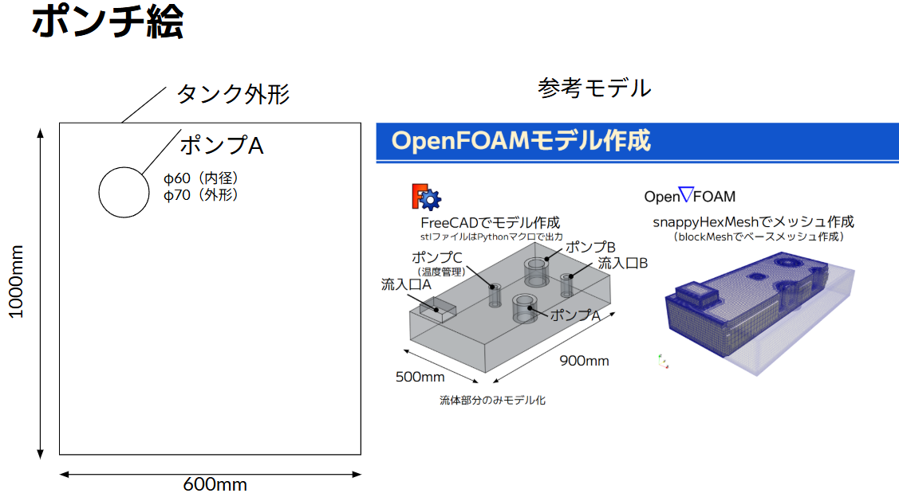
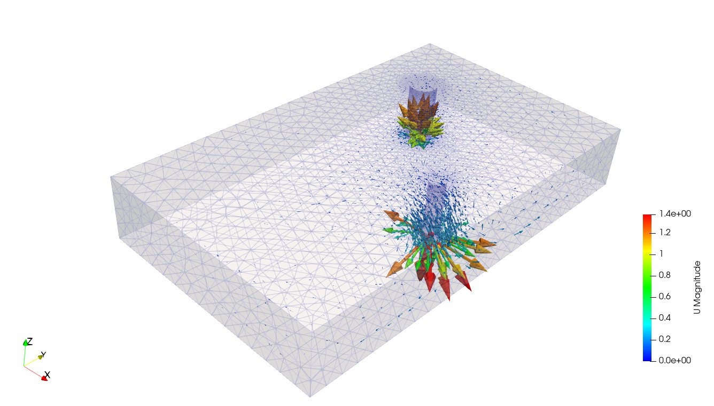
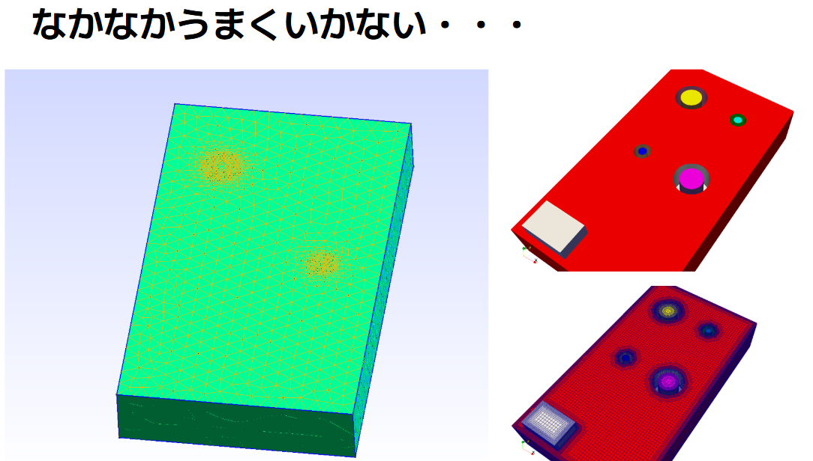

# LLM001 - LLMによるOpenFOAM解析自動化プロジェクト

## 概要

ポンチ絵からOpenFOAMの解析設定・計算実行までをLLM（Claude Code / Codex）を用いて自動化するプロジェクト。
手書きのポンチ絵と自然言語による仕様記述から、gmshメッシュ生成・OpenFOAM設定・計算実行までのパイプラインをAIが構築する。

---

## 出発点：ポンチ絵

解析の出発点は手書きのポンチ絵。タンク寸法・ポンプ位置・ポンプ径・流量・流入/流出の区別がすべてここに含まれる。



AIはこのポンチ絵を読み取り、gmsh/OpenFOAMが要求する数値設定に自動変換する。

---

## 解析仕様（ポンチ絵2）

座標・流量を追記した詳細仕様図。AIはこれをYAMLに変換する。


| 項目 | 値 |
|---|---|
| タンク | 600mm(X) × 1000mm(Y) × 160mm(Z) |
| ポンプA | 中心(150,800)mm, 外径Φ70/内径Φ60mm, 流出 |
| ポンプB | 中心(450,500)mm, 外径Φ40/内径Φ30mm, 流入 100L/min |

---

## ワークフロー

```
ポンチ絵（PNG）
    │
    ▼
config/LLM001.yaml（AI生成・人間が確認）
    │
    ▼
geometry/LLM001_pumpA.py（gmsh Python API）
    │  ブーリアン演算でタンク−ポンプ差分
    ▼
mesh/LLM001_pumpAB.msh（gmsh 2.2形式）
    │
    ▼
case/（OpenFOAMケース）
    │  gmshToFoam → changeDictionary → checkMesh
    ▼
simpleFoam / buoyantPimpleFoam 実行
```

---

## 計算結果



計算の様子はアニメーションで確認できる。


---

## 開発の軌跡：うまくいかなかったこと

LLMによる自動化では、最初から正しい結果が得られることは少ない。以下はブーリアン演算の失敗例。
左: AIの出力（ポンプがタンクから差し引かれていない）/ 右: 目標形状



**原因と解決**: ポンプ円柱の底面(z=0)がタンク底面(z=0)と完全一致するとOCCのブーリアン演算が失敗する。
ポンプを `z=-2mm` から開始する（`eps=0.002` オフセット）で解決。

---

## ツール構成

- **モデル・メッシュ・境界条件**: gmsh Python API
- **設定管理**: YAML（`config/LLM001.yaml`）+ Pythonジェネレータ
- **CFDソルバー**: OpenFOAM（simpleFoam / buoyantPimpleFoam）
- **LLM**: Claude Code (Sonnet 4.6) + OpenAI Codex

## ディレクトリ構成

```
LLM001/
├── README.md
├── config/
│   └── LLM001.yaml              # 解析パラメータ（YAML）
├── docs/
│   └── reveal_llm001_workflow.html  # プレゼンスライド
├── geometry/
│   ├── LLM001_pumpA.py          # gmsh スクリプト
│   └── run_gmsh.sh              # メッシュ生成 + gmshToFoam
├── img/                         # ポンチ絵・結果画像
├── mesh/
│   └── LLM001_pumpAB.msh        # 生成メッシュ
├── case/
│   ├── Allrun                   # 一括実行スクリプト
│   ├── 0/                       # 初期条件
│   ├── constant/                # 物性・乱流モデル
│   └── system/                  # 数値設定
├── tools/
│   └── generate_openfoam_from_yaml.py
└── logs/
    └── session_001.md           # LLMとのやり取り履歴
```

## 進捗

- [x] ポンチ絵・解析仕様の確定
- [x] gmshスクリプト作成（ジオメトリ・ブーリアン演算）
- [x] gmshメッシュ生成・境界条件設定（7パッチ正常検出）
- [x] OpenFOAMケース設定（YAML駆動、simpleFoam）
- [x] 計算実行・収束確認（残差 ~1e-6）
- [ ] buoyantPimpleFoamへの切り替え（熱流れ解析）
- [ ] 100 L/min 仕様への修正・再計算
- [ ] ParaView結果可視化
- [ ] パラメータスタディ（ポンプ位置最適化）

---

## 今後の展望：LLMによるCAEエージェント化

### 目指す解析レベル

下図のような、発熱量・流量・監視点温度が絡み合う複合熱流れ解析を、
ポンチ絵と自然言語仕様だけから自動でセットアップできるようにする。


### フェーズ1（現状）: 手順の自動化

ポンチ絵と仕様テキストを入力すると、AIがgmshスクリプト・OpenFOAMケースファイルを生成し計算まで実行する。

### フェーズ2（近期目標）: エラー自己修正ループ

```
実行 → 結果検証（checkMesh / 残差チェック）
  ↓ 失敗
原因推定（メッシュ品質？発散？境界条件？）
  ↓
パラメータ自動調整 → 再実行
```

### フェーズ3（中期目標）: パラメータスタディの自動化

YAMLの設定値を変えた複数ケースをエージェントが自律生成・並列実行し、結果を比較して最適解を提案。

### フェーズ4（長期目標）: 設計→解析→改善の自律ループ

```
設計仕様（自然言語）→ AIが形状決定 → 解析実行
→ AIが結果解釈 → 設計修正案の提案・実行 → 収束まで繰り返し
```

### 今回の実証で見えた強み

| 課題 | 従来の作業 | LLMエージェントの対応 |
|---|---|---|
| ポンチ絵の読み取り | 技術者が寸法を手入力 | 画像から座標・寸法を解釈 |
| ブーリアン演算の失敗 | エラーを自力でデバッグ | coincident face問題を自動診断・修正 |
| OpenFOAMファイル生成 | 数十ファイルを手書き | YAMLから全ファイルを自動生成 |
| 境界条件の設定 | マニュアルを参照して手設定 | 形状バウンディングボックスから自動判定 |

---

## 会話履歴

やり取りの履歴は `logs/` ディレクトリに Markdown 形式で保存。
スライド作成の際はこのログを参照してください。

プレゼンスライド: [`docs/reveal_llm001_workflow.html`](docs/reveal_llm001_workflow.html)
