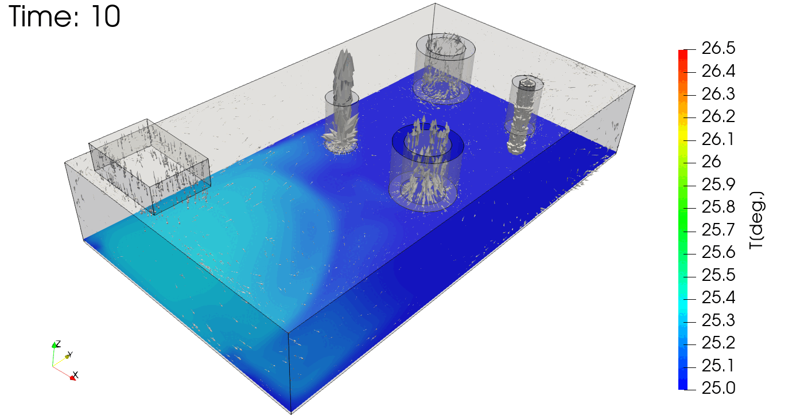
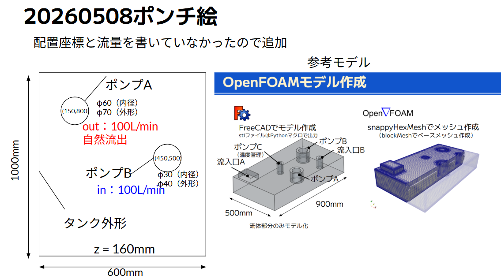
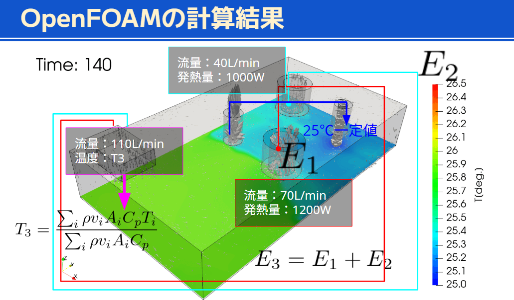

# openfoam-ai-workflow

LLM（Claude Code / Codex）を用いてポンチ絵からOpenFOAM解析設定・計算実行までを自動化するプロジェクト集。

## 目指すこと

手書きのポンチ絵と自然言語で仕様を伝えるだけで、AIがメッシュ生成・境界条件設定・計算実行を自動で行う。



## プロジェクト一覧

### [LLM001](LLM001/) - タンク内ポンプ熱流れ解析

ポンチ絵からgmsh + OpenFOAMの解析設定を自動生成した実証プロジェクト。



- **形状**: タンク(600×1000×160mm) + ポンプA(Φ70/60mm) + ポンプB(Φ40/30mm)
- **ツール**: gmsh Python API（メッシュ・境界条件）、OpenFOAM simpleFoam
- **設定管理**: YAML駆動（`config/LLM001.yaml` → OpenFOAMファイル自動生成）

**プレゼンスライド**: [LLM001/docs/reveal_llm001_workflow.html](https://kamakiri1225.github.io/openfoam-ai-workflow/LLM001/docs/reveal_llm001_workflow.html)

---

### [ana002\_buoyantPimple\_circleTempRoughMesh\_001](ana002_buoyantPimple_circleTempRoughMesh_001/) - 熱流れ解析テンプレート

LLM001の参照ケース。buoyantPimpleFoamによる温度・浮力流れの解析例。



- **ソルバー**: buoyantPimpleFoam
- **メッシュ**: snappyHexMesh（FreeCAD STLモデル使用）
- **特徴**: 発熱量・流量・監視点温度の複合解析

---

## ワークフロー

```
ポンチ絵（PNG）
    │
    ▼  AI が読み取り・YAML化
config/LLM001.yaml
    │
    ▼  gmsh Python API
mesh/LLM001_pumpAB.msh
    │
    ▼  gmshToFoam
case/constant/polyMesh/
    │
    ▼  OpenFOAM
計算結果（速度・圧力・温度）
```

## AIエージェント化の強み

| 課題 | 従来 | LLMエージェント |
|---|---|---|
| ポンチ絵の読み取り | 技術者が手入力 | 画像から自動解釈 |
| ブーリアン演算の失敗 | 手動デバッグ | 原因推定・自動修正 |
| OpenFOAMファイル生成 | 数十ファイルを手書き | YAMLから全自動生成 |
| 境界条件の設定 | マニュアル参照 | 形状から自動判定 |

## 今後の展望

1. **エラー自己修正ループ**: checkMesh・残差を監視して自動パラメータ調整
2. **パラメータスタディ**: ポンプ位置・流量を変えた複数ケースを自律実行
3. **buoyantPimpleFoam対応**: 熱流れ・浮力解析への拡張
4. **設計→解析→改善の自律ループ**: 結果をAIが解釈して次の設計案を提案
